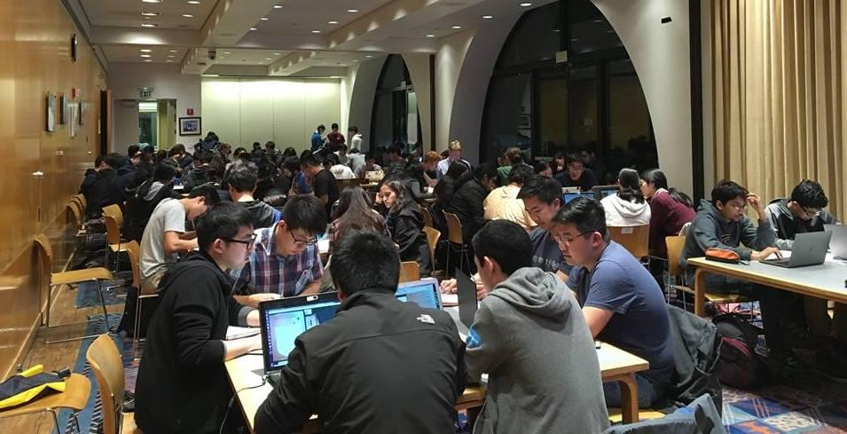
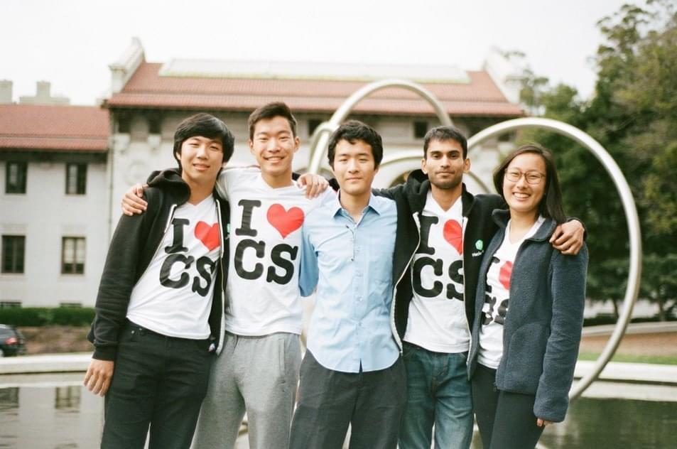

CSUA
====

##### The home for all things CS.

 

#### The Computer Science Undergraduate Association

#### Hello World!

<i class="material-icons">lightbulb_outline</i>

[//]: # See https://google.github.io/material-design-icons/#using-the-icons-in-html

The CSUA is here to make every step of your undergraduate computer science
experience smoother, easier, and more fun! Looking for an internship or a job?
Want to learn more CS skills? Need help in a class? We have it all! Come to our
events or visit us at 311 Soda Hall to check us out.

#### Who We Are

<i class="material-icons">face</i>

We are a group of smart, enthusiastic, and fun-loving students from all majors
(not just EECS and CS) who are passionate about computer science. We are
researchers, TAs, GSIs, hackers, hardware gurus, open-sourcers, professionals,
geeks, women, men, and in between. Most importantly, we are proud members of
the CS community.

CSUA members hacking into the night.

#### Need Help?

<i class="material-icons">help_outline</i>

The CSUA offers tutoring services, major declaration panels, internship
workshops, and recruiting events. You can find a list of available tutors and
office hours here. For events, click here. You can also drop by the office any
time, and an available tutor will help you.

#### Upcoming Events

<i class="material-icons">event_note</i>

- CSUA Tutoring 
    - Every weekday: office hours in link 
    - 311 Soda (CSUA Office) 
- CSUA x IEEE Hackathon 
    - Saturday, 4/14, 4:30 PM - Sunday, 4/15, 4:00 PM
    - Wozniak Lounge

CSUA officers at Hearst Mining Circle.

#### Resources

<i class="material-icons">bookmark_border</i>

**L&S CS Advisors**

- Lily Zhang - 379 Soda
- Charlene Hughes - 203 Cory
- Emerald Templeton - 377 Soda

**EECS Advisors**

- Lydia Raya - 205 Cory
- Nicole McIntyre - 205 Cory
